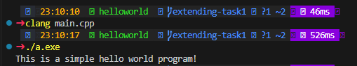
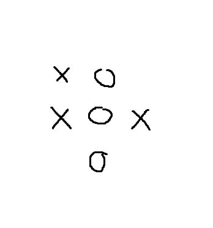
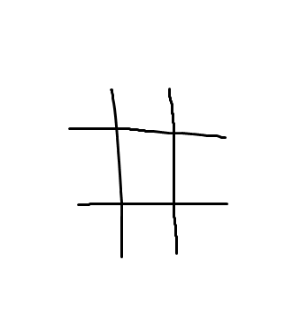
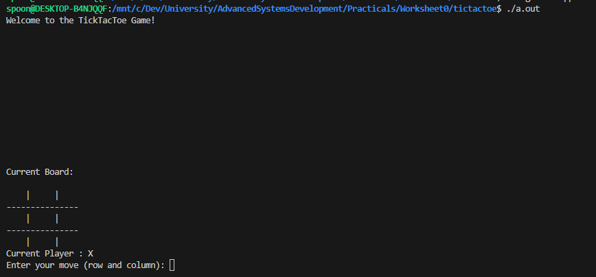
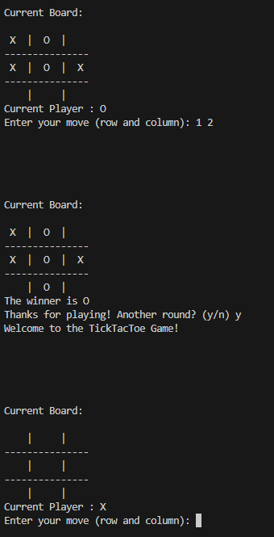

# Worksheet 0: Advanced Systems Programming

## Content
This worksheet involved setting up the c++ envrioment and creating a basic hello world, and expermineting by creating a tic-tac-toe game: allowing users to select a position on a square and the move will be placed. After each placement, Win conditions should be checked. 

## Hello World: Intro
### Everyones first program.

```cpp
#include <iostream>

int main() {
    std::cout << "This is a simple hello world program! " << std::endl;
    return 0;
}
```

This simple program serves as an example as to the most simple execution of a test application. In c++, it demonstrates a working compiler, successful execution and correctly functioning input-output.

### Breaking it down

Including a libary:
C++ comes pre-packed with tons of libraries: referred to as the Standard Includes. These are libraries which are not needed to be manually linked to the compiler.

```cpp
#include <iostream>
```

IOStream is one of these libraries. This library in particular allows the developer to interact with the console input and output functions:

```cpp

std::cin; //taking input from user

std::cout; //display output

std::endl; //ending the current line, similar to pressing enter in word

```


The **main** function:

```cpp
int main();
```
This is the function which is recognised by the compiler as the standard "Entry point" for an executable file. 

> Its important to remember that different build targets will require different Entry point naming conventions. For example, the standard name of the entry point of a DLL (dynamic link library) is `DllMain()`.

All functions in C++ must be defined with a type. The **main** function is no exception. Here, the declaration states that it is an Interger function: meaning it returns an Integer, also known as a whole number. Given the way C++ records standard **Int***s*, this is a signed number. This means it can return **ratonal positive** *and* **negative** values.

Example definition can be seen below:
```cpp
int main()
{
    return 0; //exit code 0 commonly referring to a successful execution
}
```

finally, putting it together we have a "**Hello world**" program. 

```cpp
#include <iostream> //include the std input output stream libary

int main() { //begin int main definition

    std::cout << "This is a simple hello world program! " << std::endl; // displaying message, then ending the line

    return 0; // return 0 to indicate a successful indication.
}
```

### Building
Building can take many forms. Largely, this will depend on what compiler you are using. The **Clang** compiler has been the choice for this module. It supports multiple architectures, operating systems, and the use of assembly within C and C++.

When building, the compiler will look for the known "**Entry point**". This is the first line of code which will be executed by an active thread. This Entry Point is by default the `main()` function. This can, however, be modified during the build phase.

In an example such as this "Hello World" program, suppose this code is stored in a file called "main" with the extension ".cpp". While the name is arbatrary, and can be anything, the importance comes from the extension. This specifies that the file contains C++ code, so the compiler knows what to do when it is encountered. 

Building a file described in this way can be acheived by executing this terminal command in the same directory as the "main.cpp" file.

On linux:
```bash
➜ clang main.cpp -lstdc++
```

On Windows:
```bash
➜ clang main.cpp
```

### Walkthrough
The first part of this command `clang` is the compiler reference and will only work once clang has been added to the path. This is a simple process which enables the user to access folders from anywhere within terminal. 

Next, we have the files to be included in the compilation. This can be seen in the first argument, `main.cpp`. Given the simplicity of this program, only one file is included. 

Finally, there are the libary includes. Again, the simplicity of the application means not much is needed besides the standard libary `-lstdc++`. This provides an extensive list of pre-made functions that prove invaluable to c++ developers.  

The reason for the differences is the way the compiler is setup for different enviroments. Linux requires a more explicit definition of included libararies. On windows, the standard libarary is included by default and therefore not needed to be included.


### Running

To run a program compiled by clang, it will again depend on the operating system used. This is because the operating systems have different executable file formats. On Windows, this creates `a.exe`. Linux creates `a.out`. 

So, to run the freshly compiled code:

On Windows:
```bash
➜ ./a.exe
```

On Linux:
```bash
➜ ./a.out
```

This line simply reads that you are accessing something in the current directory (folder) and the application name. 

### Example




## Tic-Tac-Toe: Minigame
The objective here is to build a minigame which allows two players to combat eachother in a game of Tic-tac-toe. The rules are simple. There exists a **3x3 grid**. Player 1 is __*X*__, Player 2 is __*O*__. Players take turns placing their symbol on the empty spaces of the grid. After each turn, the game should check the board for a winning player. Someone wins when they have 3 of their icons in a vertical, horizontal or diagonal line. 

### Definitions

#### Moves Enum

In tic-tac-toe, the moves are one of two. Placing an **X** or an **O** in an empty square. Defining our **Enum class** , `Move` allows for an easy way to store the state of a single gridspace. 

The choice of a custom designed type, over a regular Char, is to introduce input regulation. For instance, this means that instead of allowing the program to enter an "L" in place of a valid move, the board is locked to only receive 1 of three: " ", "X", or "O".

This is much more efficent than incorperating multiple "santiy" checks at runtime, forcing the checks to instead happen within the compiler.

```cpp
enum class Move : char {
    EMPTY = ' ',
    X = 'X',
    O = 'O', 
};
```

Reading through this line-by-line, we are setting creating an enum class named **Move**: using a char as the base value type. 
Inside this structure, there are three options: *empty*, *X*, or *O*. As the structure only accepts char elements, these are refernced as
```cpp
EMPTY = ' ',
X = 'X',
O = 'O',
```

#### Board Structure

Next up, the playing board. Lets break this down. A struct is a developer designed data structure, similar to a Class. This allows the developer to hold multiple variables and functions relating to these variables.

The only variable stored inside this structure is a 3x3, 2-Dimensional array of Moves. It also has one function, the constructor.

Functions created have direct access to the data inside the object, meaning you can also more easily manipulate it without having to pass the relavent variables. They also help to keep relavent data neatly packed together. 

```cpp
struct Board {

    Move possibleMoves[3][3];

    Board();

};
```

Lets take a deeper look at the structure's constructor. This is the function which is called automatically on structure creation. It is often used to initialise the variables used within the structure and this is exactly what is seen here.

```cpp
Board::Board(){

    for (int y = 0; y <3; y++ ){
        for (int x = 0; x <3; x++ ){

            this->possibleMoves[x][y] = Move::EMPTY;
        }
    }
}
```
Line by line, whats happening within this function is that nested for loops are being defined. A **Y** incriment and an **X** incriment. As the **Y** is on the outer loop, this is be increased after the x: which is typical in most forms of graphing. 

Looking at these loops closer, they range from 0 -> 2. This encompuses the board dimensions, and means that each space is visited once. Inside the loops, we are setting the current position to be an `Move::Empty`, (An empty move). This means that the program is setup for the user to begin placing their symbols, as these can only be placed on an empty grid spaces. 


> It is important to note the usage of **x++ and y++**. In this format, the current cycle is executed and then the variable is increased. This means that for the duration of the first loops, both are equal to 0. If **++x and ++y** were used instead, the value would be incrimented before the cycle. Similarly, this would result in the first loop both having values of 1 for its duration.  

### Game Declaration

Here, classes are the most optiomal choice of data structure. Similar to Structs, classes provide a way to package variables and functions (also known as class methods) so that data is readily availble to the functions. One key advantage here is the optionality of **public**, **private** and **protected** variables and methods. 

**"private"** provides ways of securing parts of the class, only giving the functions inside the current instance access to the locked parts.
**"protected"** is similar, however child classes which inherit from the current class will be able to access the locked parts too. 
**"public"** are the only things visible from the outside of the class instance.  


```cpp
class TickTacToe {
    public:
        TickTacToe();

        void ResetGame();
        Move WinCondition();
        bool MakeChoice();
        void PrintBoard();
    private:
        Move Turn;
        Board* board;
};
```

Looking closer at this class, we can see building blocks from the previously staged parts of this worksheet. On the outer rim, there is the class declaration. `TickTacToe` has multiple methods and two variables. All of its methods are public, privatising only its varaibles. This is to allow for external access to mechanics, without exposing any of the raw elements.  

The public methods include a Constructor and 4 other methods. The Constructor function never has a type, as the type returned is the class itself. Similarly, the constructor will always have the name name as the class it is creating. This is how we can tell that the constructor is `TickTacToe()`.

The other functons return types that have not yet been covered. Void is term (syntax) for something that is empty and doesnt exist. Knowing this, we can deduce that the functions marked with the `void` return type do not return anything. 

`bool` is another type that is included by default within C++. It referrs to the basic state of a switch: on, or off. In this context, numbers represent the values: 1 is on, 0 is off. These are commonly refernced with `True` or `False`. 

Our final function returns a custom type that we have pre-defined. `Move` can only return 1 of three values: `Move::Empty`, `Move::X`, or `Move::O`.


#### Method Definitions

Resetting the Game:
```cpp
void TickTacToe::ResetGame(){};
```

When defining class methods externally from the class body, its important to note that the definition **must** include a reference to the class it belongs to. Additonally, the code which is ran when the function is called is located inside the `{}` brackets. This function would compile, but it would not do anything when called as nothing is inside the brackets.

```cpp
void TickTacToe::ResetGame(){

    this->board = new Board();
    this->Turn = Move::X;
}
```

This function stays relativly small as there are not many variables to modify. We created our `Board` constructor in a way that initialises every space to `Move::Empty`. So, in order to reset the board, we can simply create a new board object. As the class variable, `TickTacToe.Board`, is a pointer- this must be a pointer object that is created, instead of a local object. A key difference here is that the variable only requires 8 bytes for stoage, as this is building for x64. In an x86 system (32bit), this would only be 4 bytes. Instead of directly storing the Board object inside the class, a new instance of the class is created externally and its address is saved in the pointer. This allows TicTacToe class to directly interface with another instance of a Board.

Choosing which player should go first is arbatrary. For this example, the first player to make a move will always be the **X** player. We can see this as the Turn is initialised to `Move::X`.

> It is important to note that the `this`

The Constructor:
```cpp
TickTacToe::TickTacToe(){}
```

Typically we should demonstrate the constructor before another method. However, in this instance, the `ResetGame()` method can be used as the constructor. This is because they should both have the same functionality: setting the game up for a fresh cycle.

This can be acheived with the following code:
```cpp
TickTacToe::TickTacToe(){
    this->ResetGame();
}
```

This will simply call the `ResetGame()` method when the constructor is called. 

Making a choice:
```cpp
bool TickTacToe::MakeChoice(){}
```

As previously mentioned, this method should return either True (if the move is placed) or False (if the move is not placed).

The function should take input from the user in form of (x,y) coordinates. 
It should then check if the selection is empty. If someone has already placed a move in the position: return False, as the move could not be placed.

Once the move is certinly empty, the move is placed. The turn is then switched before returning True, as the move was successful.

Here is what this could look like:

```cpp
bool TickTacToe::MakeChoice(){

    int x,y; // declaring variables to store user input

    std::cout << "Current Player : " << (this->Turn == Move::X ? "X" : "O") << std::endl; // print the current player
    std::cout << "Enter your move (row and column): "; // request the input
    std::cin >> x >> y; // take the input (first number as x) (seond number as y)


    if (this->board->possibleMoves[x][y] != Move::EMPTY){ // if the current selection is not empty
        return false; // return false
    }

    // at this point, we know the position is empty as the function has not returned false.

    this->board->possibleMoves[x][y] = Turn; // set the position to the players symbol

    if (this->Turn == Move::X){ // if the current player is X
        this->Turn = Move::O;   // set the next player to be O
        return true; // return True because the move was placed
    }

    // At this point, we know the current player is not X because the function would have returned True already.

    this->Turn = Move::X; // set the next player to be X
    return true; // return True because the move was placed
}
```

This function uses a stlye of programming called anti-nesting. 
Nesting is a form of programming which allows the developer to create complex statements with the use of `if`, `else if`, or `else` statements. 
Anti-nesting seeks to use the advantages of decision baseed programming, whilst maintaining readable code. 
This can greatly help when trying to share your work with others as the code becomes much more interpertable to the natural language. 
It can also greatly help to reduce the number of instructions executed by you CPU, as there is no longer the need for an else statement.

A function that preforms the same execution could be seen as:

```cpp

    int x,y; // declaring variables to store user input

    std::cout << "Current Player : " << (this->Turn == Move::X ? "X" : "O") << std::endl; // print the current player
    std::cout << "Enter your move (row and column): "; // request the input
    std::cin >> x >> y; // take the input (first number as x) (seond number as y)


    if (this->board->possibleMoves[x][y] != Move::EMPTY){ // if the current selection is not empty
        return false; // return false

    } else {
        // at this point, we know the position is empty as the function has not returned false.

        this->board->possibleMoves[x][y] = Turn; // set the position to the players symbol

        if (this->Turn == Move::X){ // if the current player is X
            this->Turn = Move::O;   // set the next player to be O
        } else {
            // At this point, we know the current player is not X because the function would have returned True already.
            this->Turn = Move::X; // set the next player to be X
        }

        return true; // return True because the move was placed

    }
```

Although this code preforms the same task, it is far more complicated to understand and could require a new developer to trace the flow with their mouse. 
A more linear flow can help dramatically to simplify the logic.

Checking for a winner:
```cpp
Move TickTacToe::WinCondition(){}
```
As denoted by the return type, this function should return a Move value. 
Knowing the ways a player can win in this game, we can deduce that within this function there should be:
- A check along each x axis
- A check along each y axis
- A check from top left to bottom right
- A check from top right to bottom left

Each of these checks should be to see if the criteria are filled with idential `Move` types, so long as these are not empty.

If any of these checks find that they contain the same moves, the found move should be returned. If none of the checks force an early exit, return `Move::Empty` as nobody has won.

An example function could look like this:
```cpp
Move TickTacToe::WinCondition(){

    for (int i = 0; i < 3; i++){ 
        
        // Checking columns
        if(this->board->possibleMoves[i][0] != Move::EMPTY && ( // x is represented by i and y is 0, check the location is not empty
                this->board->possibleMoves[i][0] == this->board->possibleMoves[i][1] && // if the first location is not empty and the other two locations in the column are idetnial
                this->board->possibleMoves[i][1] == this->board->possibleMoves[i][2]
            )
        ) {
            return this->board->possibleMoves[i][0]; // return the symbol in the first position, as this is the winner.
        }


        // checking rows
        if(this->board->possibleMoves[0][i] != Move::EMPTY && ( // y is represented by i and x is 0, check the location is not empty
                this->board->possibleMoves[0][i] == this->board->possibleMoves[1][i] && // if the first location is not empty and the other two locations in the row are idetnial
                this->board->possibleMoves[1][i] == this->board->possibleMoves[2][i]
            )
        ) {
            return this->board->possibleMoves[0][i]; // return the symbol in the first position, as this is the winner.
        }

    }


    // diaganal checks

    // tl-br
    if (this->board->possibleMoves[0][0] != Move::EMPTY && ( // check that the top left is not empty
            this->board->possibleMoves[0][0] == this->board->possibleMoves[1][1] && //if the top left is not empty, and the middle and bottom right are all identical
            this->board->possibleMoves[1][1] == this->board->possibleMoves[2][2]
        )
    ) {
        return this->board->possibleMoves[0][0]; // return the symbol in the top left position, as this is the winner.
    }

    // tr-bl
    if (this->board->possibleMoves[0][2] != Move::EMPTY && ( // check the top right is not empty
        this->board->possibleMoves[0][2] == this->board->possibleMoves[1][1] && //if the top right is not empty and the the middle and bottom right are all identical
        this->board->possibleMoves[1][1] == this->board->possibleMoves[2][0]
        )
    ) {
        return this->board->possibleMoves[0][2]; // return the symbol in the top right position, as this is the winner.
    }

    // if we are at this point, we know that nobody has won as all win conditions have been met.

    return Move::EMPTY;  // knowing nobody has won, return empty to signify that nobody has won.
}
```

> ***NOTE*** : The keyword `this` is a pointer to the current instance of the class. By using the member access operator `->`, we can access a member variable or function belonging to this instance, via the `this` pointer. Pointers will be discussed in greater detail later, for now: the easiest explination is that the memory address is being accessed, instead of the variable directly.  


Printing the board:
```cpp
void TickTacToe::PrintBoard(){}
```
In the games current capacity, everything that is absolutly needed in order to play has been created. However, there is no way to display the grid. This isnt necessasary if everyone has an eidetic memory, but lets assume the players do not. Printing the board allows players to have a visual representiation of the current state of the game, returning the game to its roots: instead of changing it to a memory based game.

Knowing how the `Board` stores data, we can create a simple loop to visit each space and print its value. 
This would work, but the board would look messy and hard to read. This could also result in users accidently placing their symbol in the wrong location, as the locations are not clearly marked. 



Typically, the board for a tic tac toe game is a grid pattern:



In order to create a print function that mimics this design, small amounts of logic need to be implimented.
Looking at the vertical lines, they occur after each *X* value: besides the last. 
The same is said for the horizontal lines and the *Y* values.

From this analysis, the full function might look like something like this:

```cpp
void TickTacToe::PrintBoard(){
    std::cout << "\n\n\n\n" << std::endl; // Create some space at to avoid confusion
    std::cout << "Current Board:\n" << std::endl;  // describe what is being printed

    
    for (int y = 0; y <3; y++){ // loop 0-2 along the y axis

        for (int x = 0; x <3; x++){ // loop 0-2 along the x axis

            std::cout << (this->board->possibleMoves[x][y] == Move::EMPTY ? "   " : this->board->possibleMoves[x][y] == Move::O ? " O " : " X "); //  print the value in the current space using a Lamda function


            if (x < 2) { // if the x index is not the last index
                std::cout << " | "; // add a vertical line
            } else { // 
                std::cout << std::endl; // otherwise, end the line
            }

        }

        if (y < 2) { // if its not the last y index
            std::cout << "---------------" << std::endl; //add a horizontal line spanning the entire row
        }
    }

    //nothing is returned as this is a Void return type function
}
```

Thats it! all of the building blocks for the game are declaried and defined. A good practice would be to contain these inside headder and source files.

> Note the use of a Lamda function here. These are perfect for instances where you need an if statement, but do not require the full functionality of an if statemnt. The basic syntax is as follows `( condition ? True : False )`

The first part of the lamda function,  `this->board->possibleMoves[x][y] == Move::EMPTY`, is the condition. If this is true, the value after the `?` is used. Otherwise, the value after the `:` is used. In this specific instance, there is actually another lamda function. This time, to decide which player is present, instead of if there is a player present. 

### Putting it all together

Previously we looked at writing code in a `main.cpp` file. This would work, but in large programs can become increasingly unmanagable. 

Storing the declariations in a Headder file:
<details>
    <summary> Example TicTacToe.hpp file </summary>

        #pragma once


        enum class Move : char {
            EMPTY = ' ',
            X = 'X',
            O = 'O',

            
        };


        struct Board {

            Move possibleMoves[3][3];

            Board();

        };

        class TickTacToe {
            public:

                TickTacToe();

                void ResetGame();

                Move WinCondition();

                bool MakeChoice();

                void PrintBoard();

            private:
                Move Turn;

                Board* board;


        };

</details>

<br>


Storing the definitions in a Source file:
<details>
    <summary> Example of TicTacToe.cpp </summary>

        #include "board.hpp"
        #include <iostream>

        void TickTacToe::PrintBoard(){
            std::cout << "\n\n\n\n" << std::endl;
            std::cout << "Current Board:\n" << std::endl; 

            for (int y = 0; y <3; y++){

                for (int x = 0; x <3; x++){

                    std::cout << (this->board->possibleMoves[x][y] == Move::EMPTY ? "   " : this->board->possibleMoves[x][y] == Move::O ? " O " : " X ");


                    if (x < 2) {
                        std::cout << " | ";
                    } else {
                        std::cout << std::endl;
                    }

                }

                if (y < 2) {
                    std::cout << "---------------" << std::endl;
                }
            }


        }

        Board::Board(){

            for (int y = 0; y <3; y++ ){
                for (int x = 0; x <3; x++ ){

                    this->possibleMoves[x][y] = Move::EMPTY;
                }
            }
        }


        TickTacToe::TickTacToe(){
            this->ResetGame();
        }

        bool TickTacToe::MakeChoice(){

            int x,y;

            std::cout << "Current Player : " << (this->Turn == Move::X ? "X" : "O") << std::endl;
            std::cout << "Enter your move (row and column): ";
            std::cin >> x >> y;


            if (this->board->possibleMoves[x][y] != Move::EMPTY){
                return false;
            }

            this->board->possibleMoves[x][y] = Turn;

            if (this->Turn == Move::X){
                this->Turn = Move::O;
                return true;
            }

            this->Turn = Move::X;
            return true;
        }

        void TickTacToe::ResetGame(){

            this->board = new Board();
            this->Turn = Move::X;
        }

        Move TickTacToe::WinCondition(){

            for (int i = 0; i < 3; i++){
                
                //Checking rows
                if(this->board->possibleMoves[i][0] != Move::EMPTY && (
                        this->board->possibleMoves[i][0] == this->board->possibleMoves[i][1] &&
                        this->board->possibleMoves[i][1] == this->board->possibleMoves[i][2]
                    )
                ) {
                    return this->board->possibleMoves[i][0];
                }


                //checking columns
                if(this->board->possibleMoves[0][i] != Move::EMPTY && (
                        this->board->possibleMoves[0][i] == this->board->possibleMoves[1][i] &&
                        this->board->possibleMoves[1][i] == this->board->possibleMoves[2][i]
                    )
                ) {
                    return this->board->possibleMoves[0][i];
                }

            }

            //diaganal checks

            //tl-br

            if (this->board->possibleMoves[0][0] != Move::EMPTY && (
                    this->board->possibleMoves[0][0] == this->board->possibleMoves[1][1] &&
                    this->board->possibleMoves[1][1] == this->board->possibleMoves[2][2]
                )
            ) {
                return this->board->possibleMoves[0][0];
            }

            //tr-bl
            if (this->board->possibleMoves[0][2] != Move::EMPTY && (
                this->board->possibleMoves[0][2] == this->board->possibleMoves[1][1] &&
                this->board->possibleMoves[1][1] == this->board->possibleMoves[2][0]
                )
            ) {
                return this->board->possibleMoves[0][2];
            }

            return Move::EMPTY;
        }
</details>

<br>

Finally, the Entry point for the program: the `main()` function. We can store this in the familiar main.cpp file.

```cpp
#include "board.hpp"
#include <iostream>

int main(){

    TickTacToe* runningGame; //declare the game as a pointer to an instance of the class

    while(true) { // do this loop until told not to

        runningGame = new TickTacToe(); // define a new game object and set the pointer to its address

        std::cout << "Welcome to the TickTacToe Game!" << std::endl; // display a welcome message

        while(true) { // do this loop until told not to

            runningGame->PrintBoard(); // print the current state of the board
            runningGame->MakeChoice(); // take an input from the current player
            Move Winner = runningGame->WinCondition(); // check if anyone has won

            if (Winner != Move::EMPTY){ // if the winner move is not empty (there is a winner found)
                runningGame->PrintBoard(); // print the board one last time
                std::cout << "The winner is " << (Winner == Move::O ? "O" : "X") << std::endl; // display the victor.
                break; // break form the current loop
            }
        }

        //at this point a game has finished because the inner loop has exited

        char input; // define a var for taking input
        std::cout << "Thanks for playing! Another round? (y/n)" << std::endl; // prompt if the players would like a rematch
        std::cin >> input; // take their response in form of a y (yes) or n (no) char


        if (input != 'y' && input != 'Y') { // if the answer isnt yes
            break; // break from the loop and exit the game
        }
    }

    return 0; // return 0 to indicate a successful exit. 
}
```


### Building

Similar to our hello world program, the c++ code cannot be run in its current state. It must be compiled. This process takes the C++ language and translates it into Assembly using an Assembler. This assembly is then translated into 1s and 0s, so that the hardware may understand it. This whole process is handled by the Clang compiler.

Assuming the program has been split into its reccomended sections, a build command might look something like this:

Linux:
```bash
clang main.cpp TicTacToe.cpp TicTacToe.hpp -lstdc++
```
Windows:
```bash
clang main.cpp TicTacToe.cpp TicTacToe.hpp
```

### Running
Running the provided code will provide the following output.




Entering values can be done like so:




## Summary

Within this worksheet, many topics were covered. The most important being object members: methods and varaibles. This is the foundation of C++, object orientated programming. It served to be a newer version of the C language, with additonal features aiming to make programming more manageable in larger scales. 