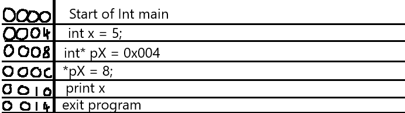
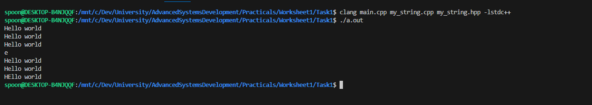
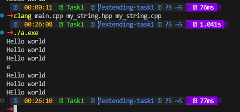

# Worksheet 1 : Reference Counting

## Task 1

### Intro

Within this task, the requirement is to create a class capable of storing a string. In C++, strings are handled differently to most languages. In C++, strings are stored as an array of characters, with a null character (`"\0"`) at the end. This is known as a **C-style string**. Knowing how arrays work in C++, we know that to access different elements, you must reference the memory address of the first element and then add the index to it. The ammount added is also reffered to as the offset.

This is the same for strings. When you pass a C-Stlye string to a function, you are actually passing the memory address of the first element. This is also why you cant return a C-style string from a function, as the memory address is moved out of scope when the function ends.

Storing a string in a class helps to fix this issue as the class can store the C-style string and return it as needed. 

### Class Definition & Method Declaration

As described, the class should have the following methods:

```cpp
    my_string();
    my_string(const char*);
    my_string(my_string const& s);
    my_string& operator= (my_string const& s);
    ~my_string();
    char getChar(const int& i) const;
    void setChar(const int& i, const char& c);
    void print() const;
```

Given the class must also store data, the class should have a private member to store the string. This can be done using a pointer to a char. Typically, strings are stored as a `const char*`, but for this task, we will store it as a `char*`. This is because we need to have the functionality of changing the string, which is not possible if defined with `const`. A work around to this would be creating a new string and overwriting the pointer, but this is not the most efficient way of doing it.

```cpp
    char* string; 
```

As discussed in the previous task, `private` elements allow developers to lock out certain aspects of an object from external modification. This is useful for ensuring that the string is not modified in a way that would break the syntax rules for a C-style string.

The final declariation should look like this:
```cpp
class my_string {
    public:
        my_string();
        my_string(const char*);
        my_string(my_string const& s);
        my_string& operator= (my_string const& s);
        ~my_string();
        char getChar(const int& i) const;
        void setChar(const int& i, const char& c);
        void print() const;

    private:
        char* string;
};
```

From the previous worksheet, we can see that there are 5 methods with the same name as the class. Given the previous ruling, we might assume that these are all constructors. Whilst this line of thinking isnt entirely wrong, it is not correct either.

Looking at the first three methods:
```cpp
my_string();
my_string(const char*);
my_string(my_string const& s);
```
We can see that these methods are defined purely as the class name. There is some variation in the paramaters, but the importance comes from before the paramaters. Observing these, we see that there are no return types or other symbols, only names of the class. This is how we can **know** these are the only constructors. 

In many languages, functions with the same name would cause errors. However, C++ adds a specific functionality known as Overloading. This allows developers to create multiple versions of the same function, all using different arguments and possibly even return types.

> Overloading, Function Overloading : using the same name for a function, allowing it to perform different tasks based on the context of its call.

> Paramaters, Arguments (synnonims) : Variables which are passed to a function, often located between two brackets. 

The next two methods are currently undiscussed. These methods provide ways to change how the class can be interacted with, post creation. 

The first is what is known as an Assignment Overload Operator. 
```cpp
my_string& operator= (my_string const& s);
```

Typically when assigning a value to an `int`, we use the `=` symbol. This is ***assigning*** the value to the variable. This is the same for classes, but by default, the `=` operator will only copy the memory address of the object, not the data it contains. This is where the Assignment Overload Operator comes in. This allows the developer to define what happens when the `=` operator is used on the class.

The final unknown method is the destructor. 
```cpp
~my_string();
```
The destructor is denoted by a `~` symbol before the class name. The `~` symbol is commonly used to denote the negative of a value, but in this case it is being used to signal the negation of a class. The destructor is called when the object is moved out of scope, or when the `delete` keyword is used. C++ is a language that requires manual memory management, so this helps to ensure that memory is freed when it is no longer needed by the application.

> Negation: The action of taking away or subtracting.

Lets store this code in a file called `my_string.hpp`.
Be sure to include the necessasary compiler directives. `#pragma once` is a good choice for this task. This ensures that the file is only included once at compile time. Failing to do this can cause issues if the file is included in multiple source files, commonly giving exceptions about redefined classes. It is often common practice to include this line in every headder file you create.


<details>
    <summary> Example my_string.hpp file (click me) </summary>

        #pragma once
        #include <iostream>

        class my_string {
            public:
                my_string();
                my_string(const char*);
                my_string(my_string const& s);
                my_string& operator= (my_string const& s);
                ~my_string();
                char getChar(const int& i) const;
                void setChar(const int& i, const char& c);
                void print() const;

            private:
                char* string;
        };
</details>

</br>


### What is a pointer?

It was previously mentioned that there would be a discussion of Pointers. The loose explination given, a pointer is a variable which allows you to interact with a memory address; instead of a variable. 

Suppose the following program:
```cpp
int main(){
    int variable = 5; // declaring and initalising the variable to the value of 5.
    int* pVariable = &variable; // declare a int pointer, assign it to the address of the variable

    *pVariable = 8;

    std::out << variable << std::endl;

    return 0;
}
```

A memory view of this application might shed some more light on what is happening.

**Memory Address** | **Instruction**


> **Note** : Memory addresses are stored in hexidecimal. This is because their large size would take up too much space and be much less readable then their binary or denary counterparts. For example, the number `999,999,999,999,999,999` represents as `0x0DE0B6B3 A763FFFF` in hexidecimal.

Here, the integer pointer `pX` is being set to the address `0x004`; the location of our *x* variable.
Then, on line 0x00c, the program is getting the address held by the pointer by dereferencing it using the `*` symbol. This would return the value `0x004`, as previously implied by setting its value on the previous line. 
Finally, the program sets the memory address to the value `8`. 

> The example is simplified for the explination purposes, and is a purely hypothetical example, showing how a pointer would work inside of a 32bit (x86) system. 64bit (x64) machines would behave in the same way. However, instead of addresses being 4 bytes, they are 8 bytes. For example, **0x0004** becomes **0x00000004**. In a real memory view, code would be presented in hexidecimal byte strings: which are largely unreadable to the human eye.


### Method Definitions

Now that the class is declaried, we can start to define the class methods.
Inside a new `.cpp` file, lets start with the empty constructor. Remember to include the headder file, otherwise the definitions for the declarations will not be linked. 

#### Empty Constructor
```cpp
my_string::my_string(){};
```

This constructor has no arguments, meaning the class can be initalised as empty.
Just because nothing is passed, does not mean that nothing needs to be done. As we learnt in the previous worksheet, constructors are used to initialise all variables so that they may be used as expected.

> Initialised, Created, Setup (Synnonims)

Knowing that we arent passing any data, but the class requires a `char*` (char pointer). To initialise this, we can simply set it to nothing.
Similar to how functions can have a `void` type, pointers can have an empty value: `nullptr`. This states that the pointer doesnt currently point anywhere.

> Null comes from the German word for Zero and is commonly used within programming to relate to a value holding nothing. Knowing this, a `nullptr` is just a pointer to the address 0x0.

With this knowledge, this is what the function might look like:
```cpp
my_string::my_string(){
    this->string = nullptr;
}
```
This code is simple. It accesses the `this` pointer, which we previously learnt was the pointer to the current class instance. From that, the address is offset to the `string` variable's position before setting the value to a `nullptr`. 

#### C-Style Constructor
The next constructor in the class definition is the C-Style constructor. This will likely be the most common way that a new version of the class is created. 
```cpp
my_string::my_string(const char* cStr) {};
```
This constructor only takes a standard C-Style string as the argument. A similar function pattern would occur from this requirement, with some additional modification.
As previously mentioned, C-Style strings are read from memory as if they were an array, with the last entry of the string being a null terminator `\0`
However, when you calculate the the length of the string- **the null terminator is not included**. This means that you must add a an extra space for it when copying into a new variable.

With this, the function might look something like this:
```cpp
my_string::my_string(const char* cStr) {

    size_t len = strlen(cStr); // get the length of the string (counts everything until the null terminator)
    len += 1; // null terminal

    this->string = new char[len]; // create a new char array with the calculated length

    strncpy_s(this->string, len, cStr, len); // copy cStr into this->string 
}
```

##### The `strncpy_s()` function:
There are a few ways to copy a string in C++; however, not many are as memory safe as this. This function requires explicit knowledge about how much data should be copied, meaning it can not overflow without being configured incorrectly. Overflows can be dangerous as it is uncertain where the extra data will flow to on the stack. If malicious code is attatched, it is possible to re-route the entire application: hijacking it by the control of an external party. 

#### Creating a new instance with an old one.
The final constructor allows it to be created using a previously created instance. This is very useful for creating copies of an instance. The specification states that it must accept a immutable class instance. This means that the class instance cannot be changed, which is a good practice because it ensures that the original instance is not modified by the new instance. 

```cpp
my_string::my_string(my_string const& s){};
```

This function is very similar to the C-Style constructor, but with a few key differences. The first is that the function is not passed a `const char*`, but a `my_string const&`. This means that the function must be able to convert the `my_string` class into a C-Style string. Which is done by accessing the `string` variable and copying it into a new variable. 

```cpp
my_string::my_string(my_string const& s) {
    size_t len = strlen(s.string); // get the length of the string stored in s
    len += 1; // null terminal

    this->string = new char[len]; // create a new char array with the calculated length

    strncpy_s(this->string, len, s.string, len); // copy s.string into this->string 
}
```

#### Assignment Overload Operator
The next method to be defined is the Assignment Overload Operator. As a reminder, this method is used to alter what happens when the `=` operator is used on the class. It is useful for ensuring that the class is copied in the way that the developer wants. 

```cpp
my_string& my_string::operator= (my_string const& s) {};
```

This function uses the same arguments as the previous constructor, but has a vastly different purpose. Instead of creating a new function, this function is used to copy data between two existing instances. An important part of this exchange is the removal of the old data which is stored by the assigned instance. This is done to ensure that the memory is freed and that there are no memory leaks. 
> Like all leaks, if they are small- they can be unnoticed. However if they are too large, they can cause a flood. This can easily result in programs not working as intended, slowing the computer, or even crashing the program entirely.

Given the return type, the function should return the current instance.

The resulting function might look like this:
```cpp
my_string& my_string::operator= (my_string const& s) {
    if(this->string != nullptr) { // check if the string is already initalised
        delete[] this->string; // delete the current string
    }

    size_t len = strlen(s.string); // get the length of the string stored in s
    len += 1; // null terminal

    this->string = new char[len]; // create a new char array with the calculated length

    strncpy_s(this->string, len, s.string, len); // copy s.string into this->string 

    return *this; // return the current instance
}
```

#### Destructor
As discussed, the destructr is denoted by the `~` symbol before the constructor name.
```cpp
my_string::~my_string(){};
```
At this point, the destructor is not needed, so we can leave this empty for now.
> It is important that the descturctor is defined, even though it is not used. If the class definition had not declaired it, this would not be necessasary. However, because the compiler is expecting a definition, one must be provided. 

#### Get Char Method
This is the first real **method** that we will be defining, and is used to get a specific character from the `char` array. It is what is known as a "Getter" method. These are used to return a value from the class, allowing the developer to share access to private variables in a controlled way.
```cpp
char my_string::getChar(const int& i) const {};
```

This function is very simple, as it only needs to return a single character from the array. The function should return the character at the index `i` in the `string` array. However, it is important to note that the function should check if the index is within the bounds of the array. If it is not, the function should return the null terminator to avoid a **memory access violation**.

> Memory Access Violation (Sigfault): When a program or script attempts to access memory that it does not have permission to access. A number of reasons can cause this, but the most common can be trying to read an invalid location in memory; possibly because it does not exist.

Similar to how `const` variables behave, the `const` keyword here is used to denote that the method, whilst belonging to the class, is not allowed to modify the class. When you declare a class method as constant, it places it into a read only mode for the class: blocking access to write attempts. 

Following guidance, your function might look like this:
```cpp
char my_string::getChar(const int& i) const {

    // check if the index is out of bounds
    if (i > strlen(this->string)  // check if the index is greater than the length of the string
        && // and
        i >= 0 // check if the index is negative
        && // and
        this->string != nullptr // check if the string is initalised
        ) {  
        return '\0'; // return null terminator as the index is out of bounds
    }

    return this->string[i]; // return the character at the index i
}
```

> **NOTE** : Typically, an `if` statement is not broken up as much as it is here. This is done purely for better notation.

> The `&&` operator: This is the logical AND operator. It is used to ensure that two values are True. If both values are True, the result is True. In all other cases, the result is False. In this instance, the two values are `i > strlen(this->string)` and `i >= 0`. 

> The `>=` operator: This is the greater than or equal to operator. The `>` symbol might be familiar from mathmatics. This operator is the same, with the addition that the values can also be equal. 

#### Set Char Method
Similar to how the `getChar` method is a Getter, this method is a "Setter". In this context, it is used to change the value of a `char` within the string. Like the getter, these methods allow the developer to change the value of a private variable in a controlled way. 

```cpp
void my_string::setChar(const int& i, const char& c) {};
```

Given our getter method, we can use the same logic to ensure that the index is within the bounds of the array. If it is within bounds, the function should access the `char` array and change the value at the index `i` to the value `c`. 

> Ensuring that the index is within bounds with a setter is just as important as with a getter. If the index is calculated correctly with a setter, it is possible to overwrite unintended parts of the application. This can cause the application to crash, or even worse, allow malicious code to be executed. Dangers of not checking the bounds on a getter could converly allow the application to read unintended parts of the application, possibly containing sensitive information.


```cpp
void my_string::setChar(const int& i, const char& c) {

    if (i > strlen(this->string) && i >= 0 && this->string != nullptr) { return; }

   this->string[i] = c;
}
```

#### Print Method
The final method to be defined is `print`. Simply put, this displays what the current string is. 

```cpp
void my_string::print() const {};
```

This method should also be constant, meaning it will not modify the origonal element. Given this is simply printing, modifications would be uncommon. However, it is good practice to ensure the class is not modified unintentially. 

It is important that this function does not try to print in situations where the string does not yet exist, as this could cause a Memory Access Violation. Given that our stored strings conform to the C-Style standard of Char arrays, with the last element being a null terminator, it is possible to iterate the array until a null terminator is found. This is exactly what is happening when the `std::cout` function prints a C-String.

The final function might look like this:
```cpp
void my_string::print() const {
    if(this->string == nullptr) { return; } // exit if the string is not yet created
    std::cout << this->string << std::endl; // print the string 
}
```

Another option for this would be to store the length of the string on creation, manually itterating over each element until the length is reached. Not only would this result in messier code, but would cascade into a linear growth of memory usage as the number of strings used increases.  


Thats it! Putting it together should result in a string capable of swapping characters and getting individual characters. 

<details>
    <summary> Example my_string.cpp file (click me) </summary>

        #include "my_string.hpp"

        #ifndef _WIN32

            #include <cstring>
            #define strncpy_s(s1, l1, s2, l2) strncpy(s1, s2, l1)
        #endif

        my_string::my_string(){
            this->string = nullptr;
        }

        my_string::my_string(const char* cStr) {

            size_t len = strlen(cStr);
            len += 1; // null terminal

            this->string = new char[len];

            strncpy_s(this->string, len, cStr, len);
        }

        my_string::my_string(my_string const& s){

            size_t len = strlen(s.string);
            len += 1; // null terminal

            this->string = new char[len];

            strncpy_s(this->string, len, s.string, len);
        }

        my_string& my_string::operator= (my_string const& s) {
            if (this->string != nullptr) {
                delete this->string;
            }
            
            size_t len = strlen(s.string);
            len += 1; // null terminal

            this->string = new char[len];

            strncpy_s(this->string, len, s.string, len);

            return *this;
        }

        my_string::~my_string(){}

        char my_string::getChar(const int& i) const {
            if (i > strlen(this->string) && i >= 0 && this->string != nullptr) { return '\0'; }

            return this->string[i];
        }

        void my_string::setChar(const int& i, const char& c) {
            if (i > strlen(this->string) && i >= 0 && this->string != nullptr) { return; }

        this->string[i] = c;
        }

        void my_string::print() const {
            if(this->string == nullptr) { return; }
            std::cout << this->string << std::endl;
        }
</details>

</br>

An important note are the compiler directives, located at the top of the page. On linux, these differ. To make it cross compatibal, a compiler statement can be used to indicate the differenes. Firstly, on linux, the `strncpy_s` function does not exist. This is a microsoft developed functon, only available on Windows. To overcome this, a **macro definition** is used. This converts the syntax into what is expected for the linux safe function, `strncpy`. 

Additionally, on linux, the `<cstring>` library must be included. This gives accesss to functions like `strlen`, a great function for easilly counting the number of chars before a null terminator. On Windows, this is also included as part of the Standard Library (stdlib, lstdc++). 

### Basic Testing

Here, an example program is provided. Lets store this inside `main.cpp`. It holds similar elements to the first program created in Worksheet0, using our custom string class instead of the standard library. 
```cpp
#include "my_string.hpp"

int main() {
    my_string s("Hello world");
    s.print();
    {
        my_string t = s;
        s.print();
        t.print();
        std::cout << s.getChar(1) << std::endl;
        s.print();
        t.print();
    }
    s.setChar(1,'E');
    s.print();
}
```

#### Compiling

Compiling this program could be done with a build command such as:
Linux:
```bash
clang main.cpp my_string.cpp my_string.hpp -lstdc++
```
Windows:
```bash
clang main.cpp my_string.cpp my_string.hpp
```

Using the same execution command, `./a.out`, should show the following output:

##### Linux:


##### Windows:



## Task2

