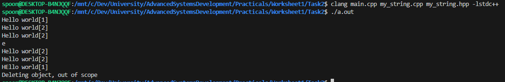
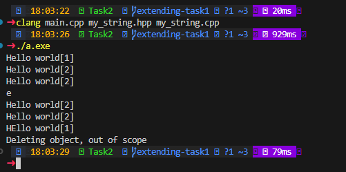
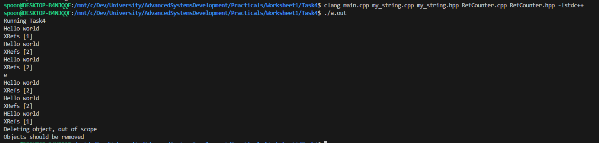
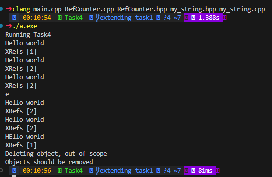

# Worksheet 1 : Reference Counting

## Task 1

### Intro

Within this task, the requirement is to create a class capable of storing a string. In C++, strings are handled differently to most languages. In C++, strings are stored as an array of characters, with a null character (`"\0"`) at the end. This is known as a **C-style string**. Knowing how arrays work in C++, we know that to access different elements, you must reference the memory address of the first element and then add the index to it. The ammount added is also reffered to as the offset.

This is the same for strings. When you pass a C-Stlye string to a function, you are actually passing the memory address of the first element. This is also why you cant return a C-style string from a function, as the memory address is moved out of scope when the function ends.

Storing a string in a class helps to fix this issue as the class can store the C-style string and return it as needed. 

### Class Definition & Method Declaration

As described, the class should have the following methods:

```cpp
    my_string();
    my_string(const char*);
    my_string(my_string const& s);
    my_string& operator= (my_string const& s);
    ~my_string();
    char getChar(const int& i) const;
    void setChar(const int& i, const char& c);
    void print() const;
```

Given the class must also store data, the class should have a private member to store the string. This can be done using a pointer to a char. Typically, strings are stored as a `const char*`, but for this task, we will store it as a `char*`. This is because we need to have the functionality of changing the string, which is not possible if defined with `const`. A work around to this would be creating a new string and overwriting the pointer, but this is not the most efficient way of doing it.

```cpp
    char* string; 
```

As discussed in the previous task, `private` elements allow developers to lock out certain aspects of an object from external modification. This is useful for ensuring that the string is not modified in a way that would break the syntax rules for a C-style string.

The final declariation should look like this:
```cpp
class my_string {
    public:
        my_string();
        my_string(const char*);
        my_string(my_string const& s);
        my_string& operator= (my_string const& s);
        ~my_string();
        char getChar(const int& i) const;
        void setChar(const int& i, const char& c);
        void print() const;

    private:
        char* string;
};
```

From the previous worksheet, we can see that there are 5 methods with the same name as the class. Given the previous ruling, we might assume that these are all constructors. Whilst this line of thinking isnt entirely wrong, it is not correct either.

Looking at the first three methods:
```cpp
my_string();
my_string(const char*);
my_string(my_string const& s);
```
We can see that these methods are defined purely as the class name. There is some variation in the paramaters, but the importance comes from before the paramaters. Observing these, we see that there are no return types or other symbols, only names of the class. This is how we can **know** these are the only constructors. 

In many languages, functions with the same name would cause errors. However, C++ adds a specific functionality known as Overloading. This allows developers to create multiple versions of the same function, all using different arguments and possibly even return types.

> Overloading, Function Overloading : using the same name for a function, allowing it to perform different tasks based on the context of its call.

> Paramaters, Arguments (synnonims) : Variables which are passed to a function, often located between two brackets. 

The next two methods are currently undiscussed. These methods provide ways to change how the class can be interacted with, post creation. 

The first is what is known as an Assignment Overload Operator. 
```cpp
my_string& operator= (my_string const& s);
```

Typically when assigning a value to an `int`, we use the `=` symbol. This is ***assigning*** the value to the variable. This is the same for classes, but by default, the `=` operator will only copy the memory address of the object, not the data it contains. This is where the Assignment Overload Operator comes in. This allows the developer to define what happens when the `=` operator is used on the class.

The final unknown method is the destructor. 
```cpp
~my_string();
```
The destructor is denoted by a `~` symbol before the class name. The `~` symbol is commonly used to denote the negative of a value, but in this case it is being used to signal the negation of a class. The destructor is called when the object is moved out of scope, or when the `delete` keyword is used. C++ is a language that requires manual memory management, so this helps to ensure that memory is freed when it is no longer needed by the application.

> Negation: The action of taking away or subtracting.

Lets store this code in a file called `my_string.hpp`.
Be sure to include the necessasary compiler directives. `#pragma once` is a good choice for this task. This ensures that the file is only included once at compile time. Failing to do this can cause issues if the file is included in multiple source files, commonly giving exceptions about redefined classes. It is often common practice to include this line in every headder file you create.


<details>
    <summary> Example my_string.hpp file (click me) </summary>

        #pragma once
        #include <iostream>

        class my_string {
            public:
                my_string();
                my_string(const char*);
                my_string(my_string const& s);
                my_string& operator= (my_string const& s);
                ~my_string();
                char getChar(const int& i) const;
                void setChar(const int& i, const char& c);
                void print() const;

            private:
                char* string;
        };
</details>

</br>


### What is a pointer?

It was previously mentioned that there would be a discussion of Pointers. The loose explination given, a pointer is a variable which allows you to interact with a memory address; instead of a variable. 

Suppose the following program:
```cpp
int main(){
    int variable = 5; // declaring and initalising the variable to the value of 5.
    int* pVariable = &variable; // declare a int pointer, assign it to the address of the variable

    *pVariable = 8;

    std::out << variable << std::endl;

    return 0;
}
```

A memory view of this application might shed some more light on what is happening.

**Memory Address** | **Instruction**


> **Note** : Memory addresses are stored in hexidecimal. This is because their large size would take up too much space and be much less readable then their binary or denary counterparts. For example, the number `999,999,999,999,999,999` represents as `0x0DE0B6B3 A763FFFF` in hexidecimal.

Here, the integer pointer `pX` is being set to the address `0x004`; the location of our *x* variable.
Then, on line 0x00c, the program is getting the address held by the pointer by dereferencing it using the `*` symbol. This would return the value `0x004`, as previously implied by setting its value on the previous line. 
Finally, the program sets the memory address to the value `8`. 

> The example is simplified for the explination purposes, and is a purely hypothetical example, showing how a pointer would work inside of a 32bit (x86) system. 64bit (x64) machines would behave in the same way. However, instead of addresses being 4 bytes, they are 8 bytes. For example, **0x0004** becomes **0x00000004**. In a real memory view, code would be presented in hexidecimal byte strings: which are largely unreadable to the human eye.


### Method Definitions

Now that the class is declaried, we can start to define the class methods.
Inside a new `.cpp` file, lets start with the empty constructor. Remember to include the headder file, otherwise the definitions for the declarations will not be linked. 

#### Empty Constructor
```cpp
my_string::my_string(){};
```

This constructor has no arguments, meaning the class can be initalised as empty.
Just because nothing is passed, does not mean that nothing needs to be done. As we learnt in the previous worksheet, constructors are used to initialise all variables so that they may be used as expected.

> Initialised, Created, Setup (Synnonims)

Knowing that we arent passing any data, but the class requires a `char*` (char pointer). To initialise this, we can simply set it to nothing.
Similar to how functions can have a `void` type, pointers can have an empty value: `nullptr`. This states that the pointer doesnt currently point anywhere.

> Null comes from the German word for Zero and is commonly used within programming to relate to a value holding nothing. Knowing this, a `nullptr` is just a pointer to the address 0x0.

With this knowledge, this is what the function might look like:
```cpp
my_string::my_string(){
    this->string = nullptr;
}
```
This code is simple. It accesses the `this` pointer, which we previously learnt was the pointer to the current class instance. From that, the address is offset to the `string` variable's position before setting the value to a `nullptr`. 

#### C-Style Constructor
The next constructor in the class definition is the C-Style constructor. This will likely be the most common way that a new version of the class is created. 
```cpp
my_string::my_string(const char* cStr) {};
```
This constructor only takes a standard C-Style string as the argument. A similar function pattern would occur from this requirement, with some additional modification.
As previously mentioned, C-Style strings are read from memory as if they were an array, with the last entry of the string being a null terminator `\0`
However, when you calculate the the length of the string- **the null terminator is not included**. This means that you must add a an extra space for it when copying into a new variable.

With this, the function might look something like this:
```cpp
my_string::my_string(const char* cStr) {

    size_t len = strlen(cStr); // get the length of the string (counts everything until the null terminator)
    len += 1; // null terminal

    this->string = new char[len]; // create a new char array with the calculated length

    strncpy_s(this->string, len, cStr, len); // copy cStr into this->string 
}
```

##### The `strncpy_s()` function:
There are a few ways to copy a string in C++; however, not many are as memory safe as this. This function requires explicit knowledge about how much data should be copied, meaning it can not overflow without being configured incorrectly. Overflows can be dangerous as it is uncertain where the extra data will flow to on the stack. If malicious code is attatched, it is possible to re-route the entire application: hijacking it by the control of an external party. 

#### Creating a new instance with an old one.
The final constructor allows it to be created using a previously created instance. This is very useful for creating copies of an instance. The specification states that it must accept a immutable class instance. This means that the class instance cannot be changed, which is a good practice because it ensures that the original instance is not modified by the new instance. 

```cpp
my_string::my_string(my_string const& s){};
```

This function is very similar to the C-Style constructor, but with a few key differences. The first is that the function is not passed a `const char*`, but a `my_string const&`. This means that the function must be able to convert the `my_string` class into a C-Style string. Which is done by accessing the `string` variable and copying it into a new variable. 

```cpp
my_string::my_string(my_string const& s) {
    size_t len = strlen(s.string); // get the length of the string stored in s
    len += 1; // null terminal

    this->string = new char[len]; // create a new char array with the calculated length

    strncpy_s(this->string, len, s.string, len); // copy s.string into this->string 
}
```

#### Assignment Overload Operator
The next method to be defined is the Assignment Overload Operator. As a reminder, this method is used to alter what happens when the `=` operator is used on the class. It is useful for ensuring that the class is copied in the way that the developer wants. 

```cpp
my_string& my_string::operator= (my_string const& s) {};
```

This function uses the same arguments as the previous constructor, but has a vastly different purpose. Instead of creating a new function, this function is used to copy data between two existing instances. An important part of this exchange is the removal of the old data which is stored by the assigned instance. This is done to ensure that the memory is freed and that there are no memory leaks. 
> Like all leaks, if they are small- they can be unnoticed. However if they are too large, they can cause a flood. This can easily result in programs not working as intended, slowing the computer, or even crashing the program entirely.

Given the return type, the function should return the current instance.

The resulting function might look like this:
```cpp
my_string& my_string::operator= (my_string const& s) {
    if(this->string != nullptr) { // check if the string is already initalised
        delete[] this->string; // delete the current string
    }

    size_t len = strlen(s.string); // get the length of the string stored in s
    len += 1; // null terminal

    this->string = new char[len]; // create a new char array with the calculated length

    strncpy_s(this->string, len, s.string, len); // copy s.string into this->string 

    return *this; // return the current instance
}
```

#### Destructor
As discussed, the destructr is denoted by the `~` symbol before the constructor name.
```cpp
my_string::~my_string(){};
```
At this point, the destructor is not needed, so we can leave this empty for now.
> It is important that the descturctor is defined, even though it is not used. If the class definition had not declaired it, this would not be necessasary. However, because the compiler is expecting a definition, one must be provided. 

#### Get Char Method
This is the first real **method** that we will be defining, and is used to get a specific character from the `char` array. It is what is known as a "Getter" method. These are used to return a value from the class, allowing the developer to share access to private variables in a controlled way.
```cpp
char my_string::getChar(const int& i) const {};
```

This function is very simple, as it only needs to return a single character from the array. The function should return the character at the index `i` in the `string` array. However, it is important to note that the function should check if the index is within the bounds of the array. If it is not, the function should return the null terminator to avoid a **memory access violation**.

> Memory Access Violation (Sigfault): When a program or script attempts to access memory that it does not have permission to access. A number of reasons can cause this, but the most common can be trying to read an invalid location in memory; possibly because it does not exist.

Similar to how `const` variables behave, the `const` keyword here is used to denote that the method, whilst belonging to the class, is not allowed to modify the class. When you declare a class method as constant, it places it into a read only mode for the class: blocking access to write attempts. 

Following guidance, your function might look like this:
```cpp
char my_string::getChar(const int& i) const {

    // check if the index is out of bounds
    if (i > strlen(this->string)  // check if the index is greater than the length of the string
        && // and
        i >= 0 // check if the index is negative
        && // and
        this->string != nullptr // check if the string is initalised
        ) {  
        return '\0'; // return null terminator as the index is out of bounds
    }

    return this->string[i]; // return the character at the index i
}
```

> **NOTE** : Typically, an `if` statement is not broken up as much as it is here. This is done purely for better notation.

> The `&&` operator: This is the logical AND operator. It is used to ensure that two values are True. If both values are True, the result is True. In all other cases, the result is False. In this instance, the two values are `i > strlen(this->string)` and `i >= 0`. 

> The `>=` operator: This is the greater than or equal to operator. The `>` symbol might be familiar from mathmatics. This operator is the same, with the addition that the values can also be equal. 

#### Set Char Method
Similar to how the `getChar` method is a Getter, this method is a "Setter". In this context, it is used to change the value of a `char` within the string. Like the getter, these methods allow the developer to change the value of a private variable in a controlled way. 

```cpp
void my_string::setChar(const int& i, const char& c) {};
```

Given our getter method, we can use the same logic to ensure that the index is within the bounds of the array. If it is within bounds, the function should access the `char` array and change the value at the index `i` to the value `c`. 

> Ensuring that the index is within bounds with a setter is just as important as with a getter. If the index is calculated correctly with a setter, it is possible to overwrite unintended parts of the application. This can cause the application to crash, or even worse, allow malicious code to be executed. Dangers of not checking the bounds on a getter could converly allow the application to read unintended parts of the application, possibly containing sensitive information.


```cpp
void my_string::setChar(const int& i, const char& c) {

    if (i > strlen(this->string) && i >= 0 && this->string != nullptr) { return; }

   this->string[i] = c;
}
```

#### Print Method
The final method to be defined is `print`. Simply put, this displays what the current string is. 

```cpp
void my_string::print() const {};
```

This method should also be constant, meaning it will not modify the origonal element. Given this is simply printing, modifications would be uncommon. However, it is good practice to ensure the class is not modified unintentially. 

It is important that this function does not try to print in situations where the string does not yet exist, as this could cause a Memory Access Violation. Given that our stored strings conform to the C-Style standard of Char arrays, with the last element being a null terminator, it is possible to iterate the array until a null terminator is found. This is exactly what is happening when the `std::cout` function prints a C-String.

The final function might look like this:
```cpp
void my_string::print() const {
    if(this->string == nullptr) { return; } // exit if the string is not yet created
    std::cout << this->string << std::endl; // print the string 
}
```

Another option for this would be to store the length of the string on creation, manually itterating over each element until the length is reached. Not only would this result in messier code, but would cascade into a linear growth of memory usage as the number of strings used increases.  


Thats it! Putting it together should result in a string capable of swapping characters and getting individual characters. 

<details>
    <summary> Example my_string.cpp file (click me) </summary>

        #include "my_string.hpp"

        #ifndef _WIN32

            #include <cstring>
            #define strncpy_s(s1, l1, s2, l2) strncpy(s1, s2, l1)
        #endif

        my_string::my_string(){
            this->string = nullptr;
        }

        my_string::my_string(const char* cStr) {

            size_t len = strlen(cStr);
            len += 1; // null terminal

            this->string = new char[len];

            strncpy_s(this->string, len, cStr, len);
        }

        my_string::my_string(my_string const& s){

            size_t len = strlen(s.string);
            len += 1; // null terminal

            this->string = new char[len];

            strncpy_s(this->string, len, s.string, len);
        }

        my_string& my_string::operator= (my_string const& s) {
            if (this->string != nullptr) {
                delete this->string;
            }
            
            size_t len = strlen(s.string);
            len += 1; // null terminal

            this->string = new char[len];

            strncpy_s(this->string, len, s.string, len);

            return *this;
        }

        my_string::~my_string(){}

        char my_string::getChar(const int& i) const {
            if (i > strlen(this->string) && i >= 0 && this->string != nullptr) { return '\0'; }

            return this->string[i];
        }

        void my_string::setChar(const int& i, const char& c) {
            if (i > strlen(this->string) && i >= 0 && this->string != nullptr) { return; }

        this->string[i] = c;
        }

        void my_string::print() const {
            if(this->string == nullptr) { return; }
            std::cout << this->string << std::endl;
        }
</details>

</br>

An important note are the compiler directives, located at the top of the page. On linux, these differ. To make it cross compatibal, a compiler statement can be used to indicate the differenes. Firstly, on linux, the `strncpy_s` function does not exist. This is a microsoft developed functon, only available on Windows. To overcome this, a **macro definition** is used. This converts the syntax into what is expected for the linux safe function, `strncpy`. 

Additionally, on linux, the `<cstring>` library must be included. This gives accesss to functions like `strlen`, a great function for easilly counting the number of chars before a null terminator. On Windows, this is also included as part of the Standard Library (stdlib, lstdc++). 

### Basic Testing

Here, an example program is provided. Lets store this inside `main.cpp`. It holds similar elements to the first program created in Worksheet0, using our custom string class instead of the standard library. 
```cpp
#include "my_string.hpp"

int main() {
    my_string s("Hello world");
    s.print();
    {
        my_string t = s;
        s.print();
        t.print();
        std::cout << s.getChar(1) << std::endl;
        s.print();
        t.print();
    }
    s.setChar(1,'E');
    s.print();
}
```

#### Compiling

Compiling this program could be done with a build command such as:
Linux:
```bash
clang main.cpp my_string.cpp my_string.hpp -lstdc++
```
Windows:
```bash
clang main.cpp my_string.cpp my_string.hpp
```

Using the same execution command, `./a.out`, should show the following output:

##### Linux:


##### Windows:


## Task2
Reference counting is a common way of managing memory in C++. It helps to keep track of how many instances there are of a class. This count can then be used to delete the object, once it is no longer needed. This is a simplistic form of **Garbage Collection**.

> Garbage Collection: The process of deleting objects in order to free up memory for the program. In languages like Rust, this is done automatically. However, in C++, this it must be done manually.

This task is to adapt the my_string class to include reference counting. This does not require much additional code, but a few changes to the class definition and the methods are required. 

### Class Definition & Method Declaration
The class definition will remain the same, only a new variable must be added. This is what will store the number of refernces to the class instance. 

```cpp
class my_string {
    public:
        my_string(); // Change required
        my_string(const char*); // Change required
        my_string(my_string const& s); // Change required
        my_string& operator= (my_string const& s); // Change required
        ~my_string(); // Change required
        char getChar(const int& i) const;
        void setChar(const int& i, const char& c);
        void print() const;

    private:
        char* string;
        uint64_t* references; // new variable to store the number of references
};
```

This is a new data type, which has previously not been covered. Similar to how an `int` is used to display whole numbers, a `uint64_t` is also used to display whole numbers. The difference here is that it may only hold rational numbers, meaning that it can not hold negative numbers. 

This is useful for storing the number of references, as it is not possible to have a negative number of references. A smaller data type could be used here, for example a `uint32_t`, but this would limit the number of possible references. It is still a very large amount that can be tracked, but given the theoretical amount of references that could be created, it is better to use a larger data type. 

The most known fear of this occurance was the turn of the millenium. Many people all over the world prepared for a disaster, assuming that planes and satallites would fall from the sky. The belief was that storing dates as two numbers (1999 becomes 99) would cause systems to crash, as they would not be able to handle the date change from 99 -> 00. This is what is known as an integer overflow. It is also refered to as an integer wrap around, as the number will jump from the maximum value to the minimum value. 

A simple fix for this issue was increasing the size of the data type to allow for 4 digits. However, not all systems could handle the memory requirements. For such systems, a "Windowing" technique was used. This meant the century could be inferred from the most likely date. For example, if the date was 01/01/01, it would be assumed to be 01/01/2001, instead of 01/01/1900. Conversley, if the date were 01/01/99, it would be assumed to be 01/01/1999, instead of 01/01/2099. The aim of this was to split the centries into two halves, with the pivot point being the current year at the time (2000).

This problem outlines why it is important to consider the type of data you are storing, and how it can be used in the future. According to the National Museum of American History, the estimated cost of the Y2K bug was between [300 and 600 billion dollars](https://americanhistory.si.edu/collections/object-groups/y2k#:~:text=Research%20firm%20Gartner%20estimated%20the,before%20midnight%20December%2031%2C%201999.). Thats a lot of money for 2 extra digits. 


A Similar issue is expected to arise with the year 2038. Currently, the way most modern computers track time, is with the Unix Timestamp. This is a 32bit integer, which counts the number of seconds since 1970. Given this value is 32bit, the maximum value that can be stored is **2,147,483,647**. As writing this, the current Timestamp is **1,730,913,877**: leaving only **416,569,770** seconds left before the wrap around. The expected date for this is **19th January, 2038**. Before this date, the world would once again switch to a 64bit timestamp, or a more robust solution must be found. 


### Method Changes

The changes to these methods are minimal and focus on the addition of the `references` pointer. 

#### Empty Constructor
```cpp
my_string::my_string(){
    this->string = nullptr;
    this->references = new uint64_t(1); // initalise the references to new uint64_t with the value of 1
}
```

The only change that was required here was for the initilsation of the references pointer. This is set to 1, as the creation of the class marks the first reference. 

#### C-Style Constructor
```cpp
my_string::my_string(const char* cStr) {

    size_t len = strlen(cStr);
    len += 1; // null terminal

    this->string = new char[len];
    strncpy_s(this->string, len, cStr, len);
    
    this->references = new uint64_t(1); // create a new uint64_t with the value of 1
}
```

The same change is made here, the addition of the references pointer.

#### Constructing with an existing instance
```cpp
my_string::my_string(my_string const& s){

    size_t len = strlen(s.string);
    len += 1; // null terminal

    this->string = new char[len];

    strncpy_s(this->string, len, s.string, len);

    this->references = s.references; // point this references to the same variable that s points to (created in the constructor)
    *this->references += 1; // dereference the references pointer and increment the value
}
```

> Dereferencing allows the developer to access the variable that a pointer is storing. This is done by using the `*` symbol before the pointer name.

> Why cant i use the **var++** syntax to incriment the references? The `++` operator is used to incriment a value by 1, however, when used in this context, it would incriment the memory address stored by the pointer, not the value stored in the address. This might cause the program to crash, as you would be trying to dereference a memory location that is offset by 1 byte from where it should be.

#### Assignment Overload Operator
```cpp
my_string& my_string::operator= (my_string const& s) {
    if (this->string != nullptr) {
        delete this->string;
    }
    
    size_t len = strlen(s.string);
    len += 1; // null terminal

    this->string = new char[len];

    strncpy_s(this->string, len, s.string, len);

    this->references = s.references; // point this references to the same variable that s points to
    *this->references += 1; // dereference the references pointer and increment the value

    return *this;
}
```

The same changes are made to the assignment operator as the previous constructor. This is because they both have the same purpose, with a different method of initialisation.

#### Destructor

As discussed, the desctructor should now be capable of clearing up memory when there are no more references to the class. This is done by decrimenting the references pointer every time the destructor is called. If the references pointer reaches 0, the memory can be freed as the class is no longer in scope. 


The destructor might look like this:
```cpp
my_string::~my_string(){
    *this->references -= 1; // decrement the references pointer
    if(*this->references == 0) { // check if references are now 0

        if(this->string != nullptr) { // check if the string is initalised
            delete this->string; // if it is, delete the string
        }
        delete this->references; // delete the references
    }
}
```

Thats it! All of the method that require change have now been modified, allowing the application to automatically track the number of references exist to the `my_string` class. This is the essence of low-level programming, and one of the largest reasons for the creation of Rust: currently one of the most memory-safe languages. Programming in Rust forces checks at compile time to ensure that the program will not create a memory leak. Other systems in this language assist in memory management, like the Ownership system, aswel as Borrowing. 

The ownership system serves garbage collection methods by allocating space with an ownership. This ownership is assigned to data, meaning when it goes out of scope, the allocated space is automatically removed using the relationship between owner and owned. 

#### Printing the references
While not necessasary, it would be good for visualisation to display the number of references that currently exist. We can do this within the print statement by simply adding the value pointed to by the references pointer. 

```cpp
void my_string::print() const {
    if(this->string == nullptr) { return; }
    std::cout << this->string << "[" << *this->references << "]" << std::endl; // dereference the pointer and print its value
}
```

<details>
    <summary> Example my_string.cpp file (click me) </summary>

        #include "my_string.hpp"
        #ifndef _WIN32

            #include <cstring>
            #define strncpy_s(s1, l1, s2, l2) strncpy(s1, s2, l1)
        #endif


        my_string::my_string(){
            this->string = nullptr;
            this->references = new uint64_t(1);
        }


        my_string::my_string(const char* cStr) {

            size_t len = strlen(cStr);
            len += 1; // null terminal

            this->string = new char[len];

            strncpy_s(this->string, len, cStr, len);
            this->references = new uint64_t(1);
        }

        my_string::my_string(my_string const& s){

            size_t len = strlen(s.string);
            len += 1; // null terminal

            this->string = new char[len];

            strncpy_s(this->string, len, s.string, len);

            this->references = s.references;
            *this->references += 1;
        }

        my_string& my_string::operator= (my_string const& s) {

            if (this->string != nullptr) {
                delete this->string;
            }

            size_t len = strlen(s.string);
            len += 1; // null terminal

            this->string = new char[len];

            strncpy_s(this->string, len, s.string, len);

            this->references = s.references;
            *this->references += 1;

            return *this;
        }

        my_string::~my_string(){
            *this->references -= 1;

            if (*this->references == 0) {
                std::cout << "Deleting object, out of scope" << std::endl;

                if(this->string != nullptr) {

                    delete this->string;
                }
                
                delete this->references;
            }
        }

        char my_string::getChar(const int& i) const {
            if (i > strlen(this->string) && i >= 0 && this->string != nullptr) { return '\0'; }

            return this->string[i];
        }

        void my_string::setChar(const int& i, const char& c) {
            if (i > strlen(this->string) && i >= 0 && this->string != nullptr) { return; }

            this->string[i] = c;
        }

        void my_string::print() const {
            if(this->string == nullptr) { return; }
            std::cout << this->string << "[" << *this->references << "]" << std::endl;
        }

</details>

<details>
    <summary> Example my_string.hpp file (click me) </summary>

        #pragma once
        #include <iostream>

        class my_string {
            public:
                my_string();
                my_string(const char*);
                my_string(my_string const& s);
                my_string& operator= (my_string const& s);
                ~my_string();
                char getChar(const int& i) const;
                void setChar(const int& i, const char& c);
                void print() const;

            private:
                char* string;
                uint64_t* references;
        };
</details>

### Testing the changes

Using the same test application, lets compile the new version of our `my_string` class.

On Linux:
```bash
clang main.cpp my_string.cpp my_string.hpp -lstdc++
```
On Windows:
```bash
clang main.cpp my_string.cpp my_string.hpp
```


Running these programs should now result in the following outputs:

##### Linux:



##### Windows:




## Task3

This task is to modify the Test program and demonstrate when the references for an object reach 0. If we look closer at the previous outputs, we can observe this is actually already happening. The initial test program provided....

```cpp
#include "my_string.hpp"
int main() { //main function scope
    my_string s("Hello world"); // references = 1
    s.print();
    { // new scope
        my_string t = s; // references = 2
        s.print();
        t.print();
        std::cout << s.getChar(1) << std::endl;
        s.print();
        t.print();
    } // call destructor for t, references = 1
    s.setChar(1,'E');
    s.print();
} // call destructor for s, references = 0
```

.... has a total of two scopes, denoted by the content of the curly brackets `{}`. 

The first scope is the main function, the second is the scope created by the curly brackets. Looking at the output of this program, we can see that the object is freed from the memory when the main function scope is exited. This is because the descructor is called automatically when the object is no longer in scope. So, when the main function is exited: the destructor will have been called for the `s` object, moving the references to 0 and freeing the memory.

## Task4

From the previous tasks, the value of reference counting should be clear. It is a simple and easy to undestand way of managing memory in C++. However, setting it up is time consuming and can result in acciedntly creating memory leaks if not done correctly, or if forgotten about entirely. It would be much more useful if we could apply a functionality to every class, without having to write the same code over and over again.

This is where Class Templates come in. As the name might suggest, their structure is very similar to that of a class. They have constructors, destructors, and methods. However, they are not classes themselves. Instead, they are used to create classes. This is highly useful when you do not know exactly what type parts of your class will be. 

For example, if you were storing an integer inside of a class, you would most likely declare it as an `int`. However, if you wanted to store a `float` instead, you would need to create an entirely new class. With templates, you can use a placeholder type, which will be replaced by the specific type when the instance is created.

### Defining a Class Template

Defining a template is simple. You must use the keyword `template`, followed by the template parameters. These will vary depending on the number of different types you want to use. For our case, we only need one. 

```cpp
template <typename T>
```

Here, `T` is the placeholder type. When the class is initated, it will be replaced by the type that is passed. Additionally, for the type to be used within the class, it must be defined just before the class definition. 

For example:
```cpp
template <typename T> // define the template
class my_class { // define the class
    public:
        my_class(T); // using the template type in the constructor to set "value"

    private:
        T value; // using the template type to define a variable
};
```

This will create a `my_class` template, which can be used to create classes with members of any type.

> Reminder: Members are the variables and methods which belong to the class.

Initalising a class with a template such as this would look slightly different to a regular class. Here, the type of the class must be defined when the class is created.
```cpp
my_class<int> a(5); // create a new instance of my_class with the type int, and set the value to 5
my_class<float> b(5.5); // create a new instance of my_class with the type float, and set the value to 5.5
```

It is worth nothing that these functions will not work if the type template is not explicitly defined. This is because compiler needs to know what type the class is, before it is created. It also helps to ensure that no wrong types are passed to the class which the class cannot handle. We, as the developer, must define the types that can be used to create the class.

```cpp
template class my_class<int>; // define the class with the type int
template class my_class<float>; // define the class with the type float
```

After implementing these changes, the class can now be used with the specified types.

### Defining a Reference Counting Class Template

Using all of the information from this worksheet, it should now be possible to build a template class which will automatically track the number of references. This could be the foundational block for a memory management library in C++.

With our knowledge about public and private members, we know that we should keep our variable inside the private section: as to avoid accidental modification. There is also the undestanding that there should be public methods to access the private variables, our Getter method. 

Given we are aiming to reference count *something*, the object to be counted should be a templated type. From our previous tasks, we also know that in order to count references, there must also be a `uint64_t` pointer. It would also be useful to know the number of references that exist to the templated type, so a method to return this value would be useful.

If we are to create a class template that can successfully emulate the `my_string` Test program, there must also be an assignment operator overload.

The fincal class definition might look something like this:
```cpp
template <typename T>
class RefCounter
{
    public:

        RefCounter(T* object); // constructor to initalise the object and the references
        RefCounter(const RefCounter& other); // copy constructor

        RefCounter& operator=(const RefCounter& other); // assignment operator overload

        ~RefCounter(); // destructor

        T* getObject(); // getter for the object
        uint64_t getReferences(); // getter for the references

        void printRefs(); // print the number of references

    private:
        T* object; // the object to be reference counted
        uint64_t* references; // the number of references to the object
};
```

This will likely give an error when compiled, not only because the methods are not defined, or because the template is not defined, but because the `uint64_t` type is not defined. This type is not native to the C++ language, and must be imported with the `cstdint` library. 

```cpp
#include <cstdint>
```
> Reminder: The `#include` directive is used to include libraries in C++. Depending on the needs of the program, this can be located in different positions within the file; but it is typically at the top of the page, directly after the `#pragma once` directive. If this is loaded before the `prama` directive, there is a chance that the library will be included multiple times, which can cause issues with the program as previously mentioned. 

### Method Definitions
A large majority of the methods within this class are the same as the `my_string` class. However, there are no longer any `char` arrays to copy, so the methods will be much simpler.

#### Constructor

Similar to how a class must be defined just after the template, so to must the methods. Lets start with the constructor. This will be used to initalise the object and the references. Unlike our `my_string` class, there is no option to create an object without a reference. This is because the object must be initalised with a value, as the reference is what is being counted. 

```cpp
template <typename T>
RefCounter<T>::RefCounter(T* object) {};
```

Similar to the `my_string` class, the constructor must initalise the object and the references. This is done by creating a new `uint64_t` pointer and setting it to 1. 

```cpp
template <typename T>
RefCounter<T>::RefCounter(T* object) {
    this->object = object; // point the object to the object passed
    this->references = new uint64_t(1); // initalise the references to 1, same as "my_string"
}
```

#### Copy Constructor
This function is almost identical to the `my_string` class, without the need to focus on string copying. Instead, just pointes are copied.
```cpp
template <typename T>
RefCounter<T>::RefCounter(const RefCounter& other) {
    this->object = other.object; // point this object to the object in other
    this->references = other.references; // point this references to the references in other
    *this->references += 1; // increment the references
}
```


#### Assignment Operator Overload
Once again, there are no real changes to this function's purpose. Instead of copying a string, a pointer is copied.

```cpp
template <typename T>
RefCounter<T>& RefCounter<T>::operator=(const RefCounter& other) {

    //doesnt need to check if the object is nullptr because the class is not initalised without an object
    this->object = other.object; // point this object to the object in other
    this->references = other.references; // point this references to the references in other
    *this->references += 1; // increment the references

    return *this; // return the current instance
}
```

#### Destructor
The destructor is also very similar to the `my_string` class. Here, instead of deleting a string, the object is deleted. Because the object could be anything, the class has no way of knowing how to delete it. This is why it is important that the object must handle its own memory management. 

```cpp
template <typename T>
RefCounter<T>::~RefCounter() {
    *this->references -= 1; // decrement the references

    if (*this->references == 0) { // check if the references are now 0
        std::cout << "Deleting object, out of scope" << std::endl;
        delete this->object; // delete the object
        delete this->references; // delete the references
    }
}
```

#### Getter Methods

These getters are simple, one is const and the other is not. Getting the object is a simple return statement, and cannot be constant as the object might need to be modified. The references, however, can be constant, as it is only being read. 

```cpp
template <typename T>
T* RefCounter<T>::getObject() { // read and write function
    return this->object; // return the object pointer
}

template <typename T>
uint64_t RefCounter<T>::getReferences() const { // read only function
    return *this->references; // return the value pointed to by the references pointer
}
```

#### Print Method
The print method is also very simple, and is used to display the number of references that exist to the object. 

```cpp
template <typename T>
void RefCounter<T>::printRefs() const {
    std::cout << "XRefs [" << *this->references << "]" << std::endl; // print the number of references
}
```

#### Explicit Template Instantiation
As we plan to use our `my_string` class with the `RefCounter` class, we must tell the compiler that this is possible. As previously shown, this can be acheived like so:
```cpp
template class RefCounter<my_string>;
```
> In order to use this class, the *my_string.hpp* file must be included. This is because the compiler needs to know what the `my_string` class is, before it can be used.

### Modifying the `my_string.cpp` from Task1

Given that memory management is automated by the `RefCounter` class, the `my_string` class must how be modified to reflect this. The only change needed is to add a destructor to the class. As mentioned, this is because the responsiblity of memory management is now handled by the `RefCounter` class. It simply invokes the destructor of the my_string class when the Reference count reaches 0.

```cpp
my_string::~my_string(){
    if (this->string != nullptr){ // if the string is initialised
        delete this->string; // delete the string
    }
}
```

### Testing the Class Template

The final step is to test the class template. Lets try to emulate the same Test program as before, but instead using the `RefCounter` class. Given the counting is no longer done by the `my_string` class, we must be slightly leaniant with the similarities. This is because the `my_string` print function no longer has access to the number of references, or even knows that it is being reference counted. Because of this, we must use the `RefCounter` print function to display the number of references after each print from the string. 

```cpp
#include "my_string.hpp"
#include "RefCounter.hpp"

int main() { // main function scope
    std::cout << "Running Task4" << std::endl;
    { // scope 2
        RefCounter<my_string> s(new my_string("Hello world")); // create a new instance of RefCounter with the type my_string, and initalise it with "Hello world"
        s.getObject()->print(); // get the object pointer and call the print function
        s.printRefs(); // print the number of refs
        { // scope 3
            RefCounter<my_string> t = s; // create an instance of RefCounter with the type my_string, and initalise it with s

            s.getObject()->print();
            s.printRefs();
            t.getObject()->print();
            t.printRefs();
            std::cout << s.getObject()->getChar(1) << std::endl;
            s.getObject()->print();
            s.printRefs();
            t.getObject()->print();
            t.printRefs();
        } // call destructor for t, references = 1
        s.getObject()->setChar(1, 'E');
        s.getObject()->print();
        s.printRefs();
    } // call destructor for s, references = 0

    std::cout << "Objects should be removed" << std::endl;
} // no destructors to call, no more objects
```

> ***Reminder*** : The `new` keyword is used to allocate memory for the object on the heap. It then returns a pointer to the object.

<details>
    <summary> Example my_string.hpp file (click me) </summary>

        #pragma once
        #include <iostream>

        class my_string {
            public:
                my_string();
                my_string(const char*);
                my_string(my_string const& s);
                my_string& operator= (my_string const& s);
                ~my_string();
                char getChar(const int& i) const;
                void setChar(const int& i, const char& c);
                void print() const;

            private:
                char* string;
        };
</details>

<details>
    <summary> Example my_string.cpp file (click me) </summary>

        #include "my_string.hpp"
        #ifndef _WIN32

            #include <cstring>
            #define strncpy_s(s1, l1, s2, l2) strncpy(s1, s2, l1)
        #endif

        my_string::my_string(){
            this->string = nullptr;
        }

        my_string::my_string(const char* cStr) {

            size_t len = strlen(cStr);
            len += 1; // null terminal

            this->string = new char[len];

            strncpy_s(this->string, len, cStr, len);
        }

        my_string::my_string(my_string const& s){

            size_t len = strlen(s.string);
            len += 1; // null terminal

            this->string = new char[len];

            strncpy_s(this->string, len, s.string, len);
        }

        my_string& my_string::operator= (my_string const& s) {
            
            if (this->string != nullptr) {
                delete this->string;
            }
            
            size_t len = strlen(s.string);
            len += 1; // null terminal

            this->string = new char[len];

            strncpy_s(this->string, len, s.string, len);

            return *this;
        }

        my_string::~my_string(){
            if (this->string != nullptr){
                delete this->string;
            }
        }

        char my_string::getChar(const int& i) const {
            if (i > strlen(this->string) && i >= 0 && this->string != nullptr) { return '\0'; }

            return this->string[i];
        }

        void my_string::setChar(const int& i, const char& c) {
            if (i > strlen(this->string) && i >= 0 && this->string != nullptr) { return; }

            this->string[i] = c;
        }

        void my_string::print() const {
            if(this->string == nullptr) { return; }
            std::cout << this->string << std::endl;
        }
</details>

<details>
    <summary> Example RefCounter.hpp file (click me) </summary>

        #pragma once

        #include <cstdint>

        template <typename T>
        class RefCounter
        {
            public:

                RefCounter(T* object);
                RefCounter(const RefCounter& other);

                RefCounter& operator=(const RefCounter& other);

                ~RefCounter();

                T* getObject();
                uint64_t getReferences() const;

                void printRefs() const;

            private:
                T* object;
                uint64_t* references;
        };
</details>

<details>
    <summary> Example RefCounter.cpp file (click me) </summary>

        #include "RefCounter.hpp"
        #include "my_string.hpp"
        #include <iostream>

        template <typename T>
        RefCounter<T>::RefCounter(T* object) {
            this->object = object;
            this->references = new uint64_t(1);
        }

        template <typename T>
        RefCounter<T>::RefCounter(const RefCounter& other) {
            this->object = other.object;
            this->references = other.references;
            *this->references += 1;
        }

        template <typename T>
        RefCounter<T>& RefCounter<T>::operator=(const RefCounter& other) {
            if (this->object != nullptr) {
                delete this->object;
            }

            this->object = other.object;
            this->references = other.references;
            *this->references += 1;

            return *this;
        }

        template <typename T>
        RefCounter<T>::~RefCounter() {
            *this->references -= 1;

            if (*this->references == 0) {
                std::cout << "Deleting object, out of scope" << std::endl;
                delete this->object;
                delete this->references;
            }
        }

        template <typename T>
        T* RefCounter<T>::getObject() {
            return this->object;
        }


        template <typename T>
        uint64_t RefCounter<T>::getReferences() const {
            return *this->references;
        }

        template <typename T>
        void RefCounter<T>::printRefs() const {
            std::cout << "XRefs [" << *this->references << "]" << std::endl;
        }


        template class RefCounter<my_string>;
</details>

### Compiling and Running

By now, the compilation process should be familiar. The same commands can be used to compile the program.

On Linux:
```bash
clang main.cpp my_string.cpp RefCounter.cpp my_string.hpp RefCounter.hpp -lstdc++
```
On Windows:
```bash
clang main.cpp my_string.cpp RefCounter.cpp my_string.hpp RefCounter.hpp
```

Running the program should result in the following output:

##### Linux:



##### Windows:




## Conclusion

This worksheet focused a lot on memory management and access within C++. It focused heavily on pointers and automation, emphasising the use of Object Orientated Programming. One of the most important topics covered was the use of templates. These empower developers to write more dynamic code, allowing for much easier management of large code bases. 

